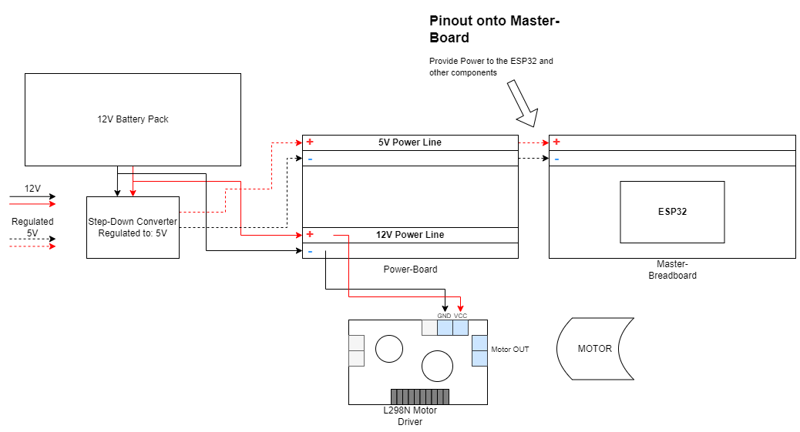

# T1-Project_Autonom
Projekt für einen autonom fahrendes T1 Modell auf basis des ESP32

Funktionen:
  - Vorwärts-/ Rückwärtsfahrt
  - Lenkung links/rechts
  - Licht
  - Steuerbar

Wokwi Diagramm: https://wokwi.com/projects/361870353311948801
  
Oberflächliches Pinout für den ESP32:

--- 
### Komponente
- HC-SR04 Ultraschallsensor
- DC Motor
- SBC-MotorDriver2
- ESP32
- Simple Battery Pack
- 12V to nth Volt Stepdown Converter
- 12V Batteries